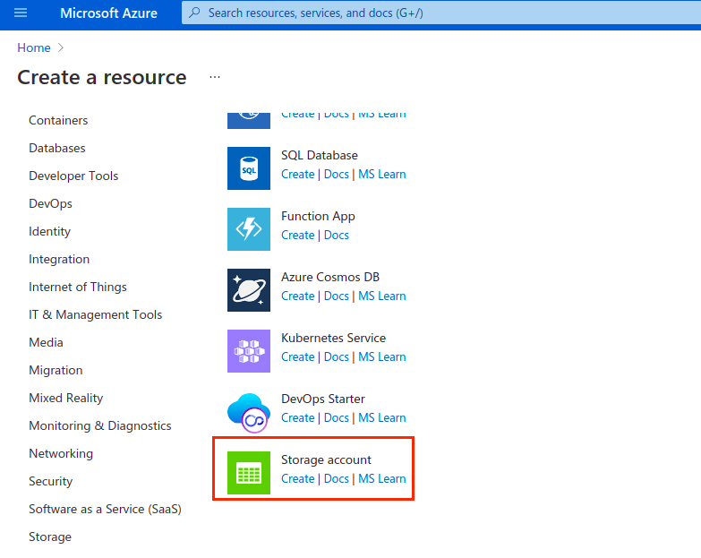

# Azure Blob Storage Workshop

A workshop on working with Azure Blob Storage in an ExpressJS application.

## Prerequisites

1. NodeJS v14 or higher
2. npm v6 or higher
3. Azure subscription

## Installation

1. Clone this repo using

```
git clone https://github.com/vicradon/azure-blob-storage-workshop
```

2. Install dependencies

```
npm i
```

3. Create an environment file

```
cp .env.example .env
```

4. Add the application port to the PORT key in the .env file

```
PORT=3000
```

5. Obtain the AZURE_STORAGE_ACCOUNT_NAME and AZURE_STORAGE_ACCOUNT_ACCESS_KEY variables

## How to obtain the storage account variables

1. Sign in to your Azure Portal
2. Create a storage account in a new resource group
   
   
3. Once the deployment is complete, create a container for uploaded images called `app-uploads`
   

4. Navigate to the section and obtain the access keys
   

5. Add them to your application

## Running your app locally

To run the app locally, run `npm run dev`
